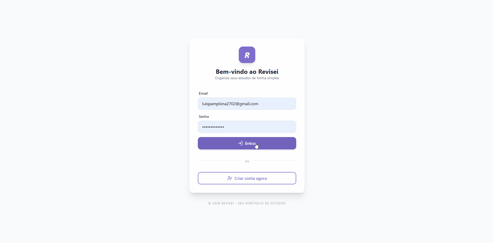
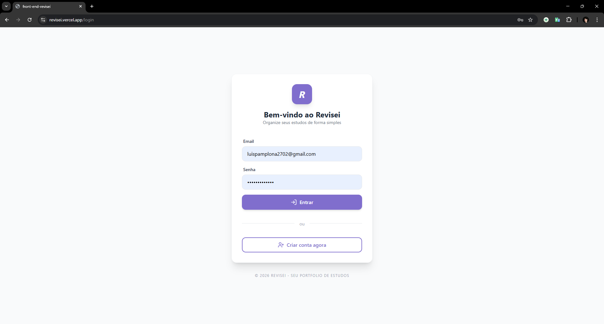
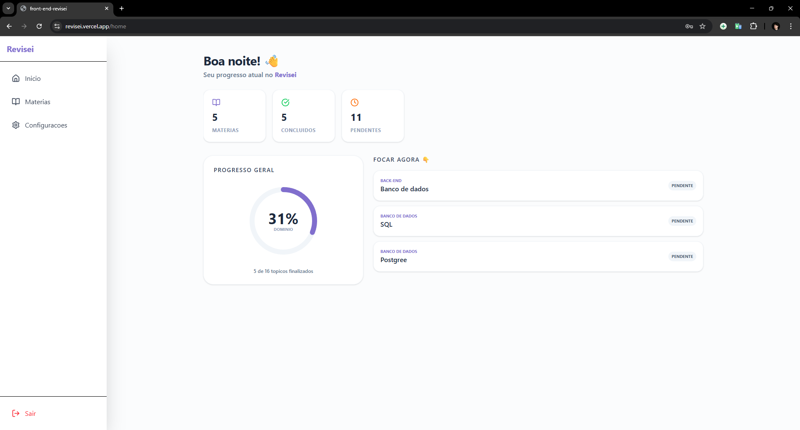
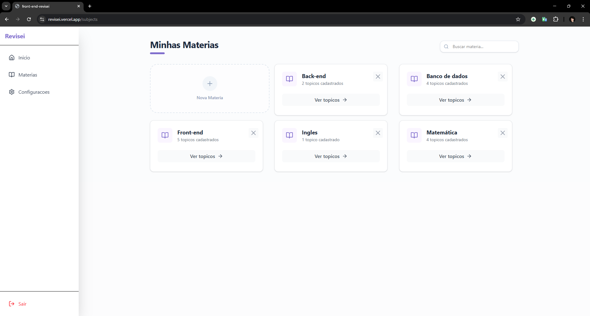
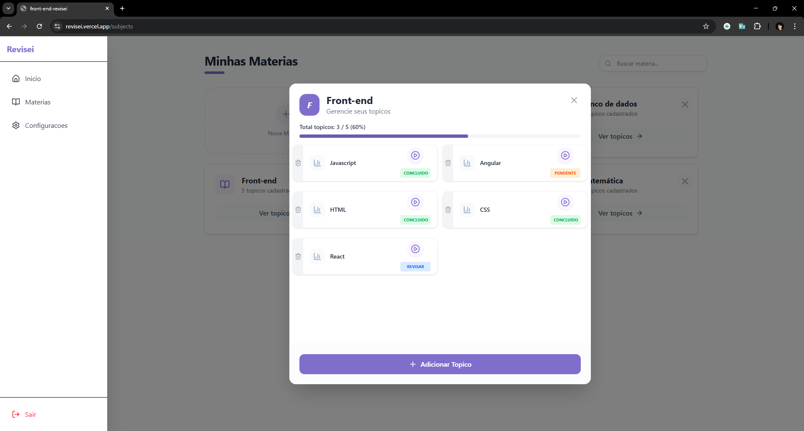
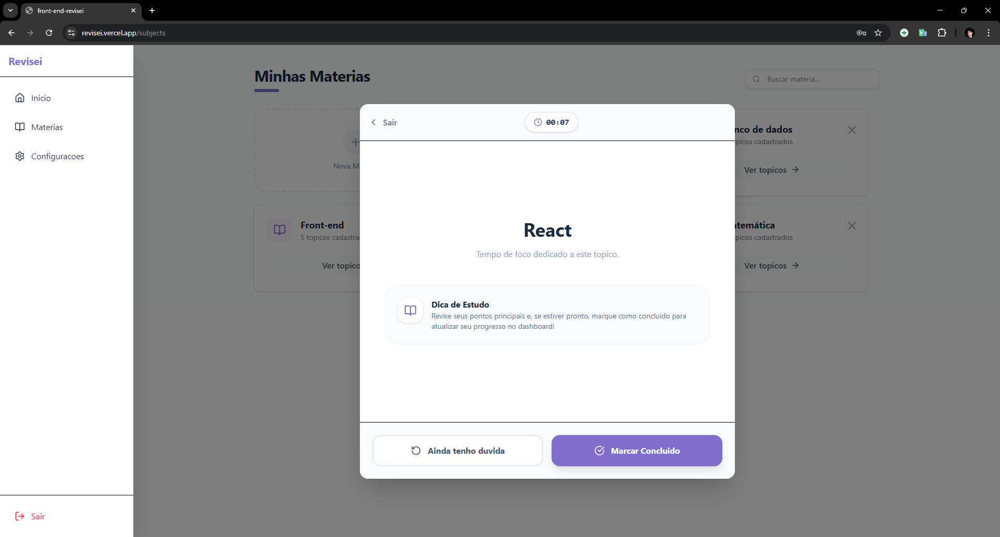
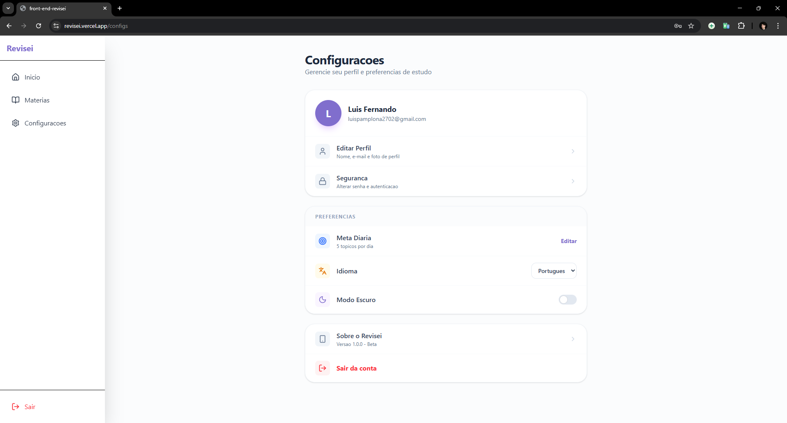

# Revisei

Aplicação web para organização de estudos, permitindo ao usuário criar matérias, gerenciar tópicos e acompanhar seu progresso de forma simples e eficiente.

**Aplicação em produção:** https://revisei.vercel.app/ <br>
**Backend (API):** https://github.com/LuisFPamplona/back-end-revisei

---

## Preview

<p align="center">
  
</p>
<h3>Telas</h3>
<p align="center">
  
  
  
  
  
  
</p>

---

## Funcionalidades

* Autenticação de usuários (registro e login)
* Criação e gerenciamento de matérias (subjects)
* Organização de tópicos por matéria
* Controle de status dos tópicos (pendente, revisar, concluído)
* Sessão de revisão com cronômetro
* Internacionalização (i18n)
* Sistema de loading global integrado às requisições
* Feedback ao usuário com notificações (toasts)
* Configurações de conta:

  * Atualização de perfil
  * Alteração de senha
  * Definição de meta diária

---

## Arquitetura

O projeto é dividido em frontend e backend independentes, comunicando-se via API REST.

### Frontend

* React com TypeScript
* Vite como bundler
* Context API para gerenciamento de estado global
* Sistema de loading global desacoplado da árvore de componentes
* Internacionalização com i18next
* Camada de requisição centralizada (`fetchWithAuth`)

### Backend

* Node.js com Express
* Prisma ORM
* Autenticação baseada em JWT
* Middleware para proteção de rotas
* Estrutura modular (routes, controllers, services)

### Banco de Dados

* PostgreSQL (Neon)

### Infraestrutura

* Vercel (Frontend)
* Render (Backend)
* Neon (Banco de dados)

---

## Tecnologias utilizadas

### Frontend

* React
* TypeScript
* Vite
* i18next
* react-toastify

### Backend

* Node.js
* Express
* Prisma
* JSON Web Token (JWT)
* bcrypt

---

## Estrutura do projeto

### Frontend

```txt
src/
  components/
  contexts/
  services/
  config/
  pages/
  i18n/
```

### Backend

```txt
src/
  routes/
  controllers/
  middlewares/
  services/
  prisma/
```

---

## Como rodar o projeto localmente

### 1. Clonar os repositórios

```bash
git clone https://github.com/LuisFPamplona/front-end-revisei
git clone https://github.com/LuisFPamplona/back-end-revisei
```

---

### 2. Backend

```bash
cd back-end-revisei
npm install
```

Crie um arquivo `.env`:

```env
DATABASE_URL=your_database_url
JWT_SECRET=your_secret
```

Execute:

```bash
npx prisma db push
npm run dev
```

---

### 3. Frontend

```bash
cd front-end-revisei
npm install
```

Crie um arquivo `.env.local`:

```env
VITE_API_URL=http://localhost:3000
```

Execute:

```bash
npm run dev
```

---

## Variáveis de ambiente

### Frontend

* `VITE_API_URL`: URL da API backend

### Backend

* `DATABASE_URL`: string de conexão com o banco PostgreSQL
* `JWT_SECRET`: chave secreta para geração de tokens

---

## Diferenciais do projeto

* Sistema de loading global integrado à camada de requisições
* Separação clara entre frontend e backend
* Estrutura escalável e modular
* Internacionalização desde a base da aplicação
* Deploy completo em ambiente de produção

---

## Decisões técnicas

* Uso de `fetchWithAuth` para centralizar autenticação e tratamento de requisições
* Implementação de loading global desacoplado do React para evitar inconsistências com múltiplas requisições simultâneas
* Utilização de i18next para suporte a múltiplos idiomas desde o início
* Separação de responsabilidades no backend (routes, controllers, middlewares)

---

## Próximas melhorias

* Biblioteca de matérias (templates pré-definidos)
* Dashboard com métricas de progresso
* Melhorias de responsividade para dispositivos móveis
* Sistema de notificações mais avançado

---

## Autor

Luis Pamplona

LinkedIn: www.linkedin.com/in/luis-pamplona-552030310 <br>
GitHub: @LuisFPamplona
